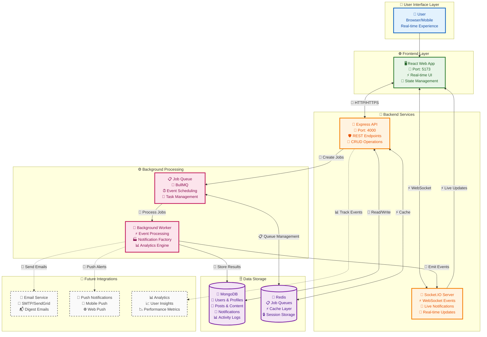
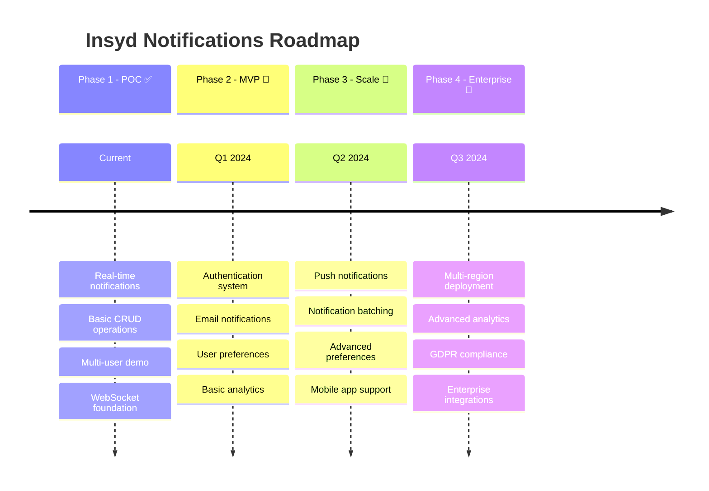

<div align="center">

# 🔔 Insyd Notifications POC

*A modern, scalable notification system for architecture professionals*

[](https://www.typescriptlang.org/)
[](https://reactjs.org/)
[](https://nodejs.org/)
[](https://www.mongodb.com/)
[](https://redis.io/)

**Optimized for ~100 DAUs with a clear path to scale to 1M+ users**

[🚀 Quick Start](#-quick-start) • [📋 System Design](./docs/system-design.md) • [🎯 How to Test](#-how-to-test) • [🛠️ Architecture](#%EF%B8%8F-architecture)

</div>

---

## 🏗️ Architecture

<div align="center">



</div>

### 🎯 Core Components

| Component | Technology | Purpose | Status |
|-----------|------------|---------|--------|
| **🌐 Web App** | React + Vite + TypeScript | User interface & real-time updates | ✅ Active |
| **🚀 API Server** | Node.js + Express + Socket.IO | REST API & WebSocket connections | ✅ Active |
| **⚡ Background Worker** | BullMQ + Redis | Async event processing | ✅ Active |
| **🔗 Shared Types** | TypeScript | Type safety across services | ✅ Active |

## 📋 Link to System Design

📖 **[Complete System Design Document](./docs/system-design.md)**

## 🚀 Quick Start

<div align="center">

**Get up and running in under 5 minutes!**

</div>

### 📋 Prerequisites

<table>
<tr>
<td align="center" width="33%">
<br/>
<strong>Node.js 18+</strong><br/>
<a href="https://nodejs.org/">Download</a>
</td>
<td align="center" width="33%">
<br/>
<strong>MongoDB</strong><br/>
<a href="https://www.mongodb.com/try/download/community">Local</a> | <a href="https://www.mongodb.com/atlas">Atlas</a>
</td>
<td align="center" width="33%">
<br/>
<strong>Redis</strong><br/>
<a href="https://redis.io/download">Local</a> | <a href="https://upstash.com/">Upstash</a>
</td>
</tr>
</table>

```bash
# Install pnpm globally if you haven't already
npm install -g pnpm
```

### 🔧 Installation

```bash
# 1. Clone & Navigate
git clone https://github.com/chiragSahani/InsydNotification.git
cd InsydNotification

# 2. Install Dependencies
pnpm install
```

### ⚙️ Environment Setup

<details>
<summary><strong>📁 Click to expand environment configuration</strong></summary>

Create `.env` files in each app directory:

<table>
<tr>
<th width="33%">🚀 API Server</th>
<th width="33%">⚡ Worker</th>
<th width="33%">🌐 Web App</th>
</tr>
<tr>
<td valign="top">

**apps/api/.env:**
```env
PORT=4000
MONGO_URI=mongodb://localhost:27017/insyd-notifications
REDIS_URL=redis://localhost:6379
CORS_ORIGIN=http://localhost:5173
SOCKET_PUBLIC_URL=http://localhost:4000
```

</td>
<td valign="top">

**apps/worker/.env:**
```env
MONGO_URI=mongodb://localhost:27017/insyd-notifications
REDIS_URL=redis://localhost:6379
```

</td>
<td valign="top">

**apps/web/.env:**
```env
VITE_API_URL=http://localhost:4000
VITE_SOCKET_URL=http://localhost:4000
```

</td>
</tr>
</table>

</details>

### 🌱 Bootstrap & Launch

```bash
# 3. Seed Demo Data
pnpm seed

# 4. Start All Services
pnpm dev
```

<div align="center">

🎉 **That's it! Your notification system is now running:**

| Service | URL | Status |
|---------|-----|--------|
| 🌐 Web App | http://localhost:5173 | ✅ Frontend |
| 🚀 API Server | http://localhost:4000 | ✅ Backend |
| ⚡ Background Worker | N/A | ✅ Processing |

</div>

## 🎯 Interactive Demo

<div align="center">

**Experience real-time notifications in action!**


*Interactive notification dashboard with real-time updates*

</div>

### 🚀 Test Flow

<table>
<tr>
<td width="50%" valign="top">

**🎭 Step 1: Choose Your User**
- Open http://localhost:5173
- Select a demo user from dropdown
- Switch between different users

**⚡ Step 2: Generate Activity**
- 📝 Create posts
- 👥 Follow other users  
- ❤️ Like posts
- 💬 Add comments

</td>
<td width="50%" valign="top">

**🔔 Step 3: Watch Magic Happen**
- Real-time notifications appear instantly
- See notification badges update
- Click to mark as read
- Observe state synchronization

**🌐 Step 4: Multi-User Testing**
- Open multiple browser tabs
- Use different demo users
- Watch cross-user interactions

</td>
</tr>
</table>

## 🔗 Links

### Repositories
- Frontend: [Placeholder - Deploy to separate repo if needed]
- Backend API: [Placeholder - Same monorepo]
- Worker: [Placeholder - Same monorepo]

### Deployments
- **Web App**: [Placeholder - Deploy to Vercel/Netlify]
- **API Server**: [Placeholder - Deploy to Render/Railway/Fly]
- **Documentation**: [System Design Document](./docs/system-design.md)

## 📁 Project Structure

<div align="center">

```
🏗️ insyd-notifications-poc/
├── 📱 apps/                    # Application services
│   ├── 🌐 web/                # React frontend application
│   │   ├── src/components/    # Reusable UI components
│   │   ├── src/contexts/      # React context providers
│   │   └── src/hooks/         # Custom React hooks
│   ├── 🚀 api/                # Express API server
│   │   ├── src/routes/        # API route handlers
│   │   ├── src/models/        # Database models
│   │   ├── src/utils/         # Utility functions
│   │   └── src/websocket/     # Socket.IO handlers
│   └── ⚡ worker/             # Background job processor
│       ├── src/processors/    # Job processors
│       └── src/queues/        # Queue definitions
├── 📦 packages/               # Shared packages
│   └── 🔗 types/             # TypeScript definitions
├── 📚 docs/                   # Documentation
│   └── system-design.md      # Architecture details
├── 🐳 docker-compose.yml     # Local development setup
├── 📋 package.json           # Workspace configuration
└── 📖 README.md              # This file
```

</div>

### 🎯 Key Directories

| Directory | Purpose | Technologies |
|-----------|---------|--------------|
| `apps/web/src/` | Frontend UI & state management | React, TypeScript, Tailwind CSS |
| `apps/api/src/` | REST API & WebSocket server | Express, Socket.IO, MongoDB |
| `apps/worker/src/` | Background job processing | BullMQ, Redis, MongoDB |
| `packages/types/` | Shared type definitions | TypeScript |

## 🧪 Testing & Commands

### 🧪 Testing Suite

<table>
<tr>
<th width="50%">🌐 All Services</th>
<th width="50%">🎯 Specific Service</th>
</tr>
<tr>
<td>

```bash
# Run all tests
pnpm test

# Run with coverage
pnpm test:coverage
```

</td>
<td>

```bash
# Individual service tests
pnpm --filter api test
pnpm --filter worker test  
pnpm --filter web test
pnpm --filter types test
```

</td>
</tr>
</table>

### 🛠️ Development Commands

<div align="center">

| Command | Description | Usage |
|---------|-------------|-------|
| 🚀 `pnpm dev` | Start all services in development | Development workflow |
| 🏗️ `pnpm build` | Build all applications | Production preparation |
| ▶️ `pnpm start` | Start production builds | Production deployment |
| 🌱 `pnpm seed` | Seed database with demo data | Initial setup |
| 🧪 `pnpm test` | Run all test suites | Quality assurance |
| 🔍 `pnpm lint` | Lint all code | Code quality |
| 🧹 `pnpm clean` | Clean build artifacts | Fresh start |

</div>

## 🚨 Troubleshooting

<div align="center">

**Stuck? Here are common fixes for typical issues:**

</div>

<details>
<summary><strong>🍃 MongoDB Connection Issues</strong></summary>

**Symptoms:** `MongooseServerSelectionError` or connection timeouts

**Solutions:**
- ✅ Ensure MongoDB is running: `brew services start mongodb-community` (Mac) or `sudo systemctl start mongod` (Linux)
- ✅ Check connection string in `.env` files
- ✅ For Atlas: verify network access and credentials
- ✅ Test connection: `mongosh "mongodb://localhost:27017/insyd-notifications"`

</details>

<details>
<summary><strong>🔴 Redis Connection Issues</strong></summary>

**Symptoms:** `Redis connection failed` or queue errors

**Solutions:**
- ✅ Start Redis locally: `redis-server` or check if running on port 6379
- ✅ For Upstash: verify REDIS_URL includes authentication
- ✅ Test connection: `redis-cli ping` (should return "PONG")
- ✅ Check firewall settings for port 6379

</details>

<details>
<summary><strong>🔌 Socket.IO Not Working</strong></summary>

**Symptoms:** Real-time notifications not updating

**Solutions:**
- ✅ Verify SOCKET_PUBLIC_URL matches your API server URL
- ✅ Check CORS_ORIGIN allows your frontend origin
- ✅ Ensure API server starts before opening frontend
- ✅ Check browser console for WebSocket errors

</details>

<details>
<summary><strong>🔌 Port Conflicts</strong></summary>

**Symptoms:** `EADDRINUSE` or port already in use errors

**Solutions:**
- ✅ Change PORT in respective `.env` files (API: 4000, Web: 5173)
- ✅ Update URLs in other `.env` files accordingly  
- ✅ Kill processes: `lsof -ti:4000 | xargs kill -9` (Mac/Linux)
- ✅ Use different ports: `PORT=4001 pnpm --filter api dev`

</details>

## 🎯 Project Scope

<table>
<tr>
<th width="50%">✅ In Scope (POC Goals)</th>
<th width="50%">❌ Out of Scope (Future)</th>
</tr>
<tr>
<td valign="top">

**Core Features:**
- ✅ Real-time notifications via WebSocket
- ✅ CRUD operations for notifications  
- ✅ User interaction tracking
- ✅ Background job processing
- ✅ Multi-user demo environment
- ✅ Responsive web interface

**Technical:**
- ✅ TypeScript throughout
- ✅ Scalable monorepo architecture
- ✅ Docker-ready setup
- ✅ Test framework foundation

</td>
<td valign="top">

**Authentication & Security:**
- ❌ User authentication & authorization
- ❌ JWT/OAuth implementation  
- ❌ Rate limiting & security measures

**Production Features:**
- ❌ Email/SMS notification delivery
- ❌ Push notifications (WebPush)
- ❌ Advanced analytics & metrics
- ❌ GDPR compliance features
- ❌ Multi-tenancy support

**Infrastructure:**
- ❌ Production monitoring
- ❌ Caching layers (Redis as cache)
- ❌ Multi-region deployment

</td>
</tr>
</table>

## 🔮 Roadmap

<div align="center">



</div>

---

<div align="center">

### 🏗️ **Built for Insyd**
*Connecting Architecture Professionals Worldwide*

[](https://github.com/your-org/insyd-notifications)
[](https://www.typescriptlang.org/)

**Questions? Issues? Contributions?**  
[📧 Email](mailto:dev@insyd.com) • [🐛 Issues](https://github.com/your-org/insyd-notifications/issues) • [💬 Discussions](https://github.com/your-org/insyd-notifications/discussions)

</div>