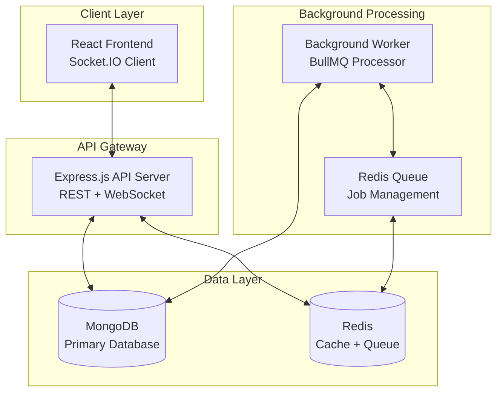

# 🔔 InsydNotification - Real-time Notification System


A **production-ready, scalable real-time notification system** built with modern microservices architecture. This project demonstrates enterprise-level development practices, event-driven architecture, and real-time communication.

## 📋 Table of Contents

- [Overview](#-overview)
- [Architecture](#️-architecture)
- [Features](#-features)
- [Technology Stack](#️-technology-stack)
- [Getting Started](#-getting-started)
- [Documentation](#-documentation)
- [Development](#️-development)

## 🎯 Overview

InsydNotification is a comprehensive notification system that handles real-time user interactions, social media features, and event-driven notifications. The system is designed to scale horizontally and handle thousands of concurrent users with reliable message delivery.

### Key Highlights

- ✅ **Microservices Architecture** - Independently deployable services
- ✅ **Real-time Communication** - WebSocket-based instant notifications
- ✅ **Event-Driven Design** - Asynchronous processing with message queues
- ✅ **Type Safety** - Full TypeScript implementation across the stack
- ✅ **Scalable Design** - Horizontal scaling capabilities
- ✅ **Modern Tech Stack** - Latest versions of React, Node.js, and databases

## 🏗️ Architecture

The system consists of three main services:



### Core Components

| Component | Technology | Purpose |
|-----------|------------|---------|
| **Frontend** | React + TypeScript + Vite | User interface & real-time updates |
| **API Server** | Node.js + Express + Socket.IO | REST API & WebSocket connections |
| **Background Worker** | BullMQ + Redis | Async event processing |
| **Shared Types** | TypeScript | Type safety across services |

## ✨ Features

### 🔔 Notification System
- **Real-time Push Notifications** - Instant delivery via WebSocket
- **User-specific Feeds** - Personalized notification streams
- **Read/Unread Tracking** - Status management and marking
- **Deduplication Logic** - Prevents duplicate notifications

### 👥 Social Features
- **User Management** - Registration and profiles
- **Follow System** - User relationships and social graph
- **Activity Feeds** - Timeline of user interactions
- **Post Creation** - Content publishing with notifications

### 🎨 UI Features
- **Dark/Light Mode** - Theme switching capability
- **Responsive Design** - Mobile and desktop optimized
- **Real-time Updates** - Instant UI synchronization
- **Interactive Dashboard** - Comprehensive user interface

### ⚡ Performance Features
- **Horizontal Scaling** - Independent service scaling
- **Caching Strategy** - Redis-based caching for performance
- **Database Optimization** - Indexed queries and pagination
- **Queue Management** - Background job processing

## 🛠️ Technology Stack

### Backend Services
| Technology | Purpose | Version |
|-----------|---------|---------|
| **Node.js** | Runtime environment | 18+ |
| **Express.js** | Web framework | ^4.18.2 |
| **TypeScript** | Type safety | ^5.3.3 |
| **Socket.IO** | Real-time communication | ^4.7.4 |
| **BullMQ** | Job queue management | ^4.15.4 |
| **Mongoose** | MongoDB ODM | ^8.0.3 |
| **Zod** | Runtime type validation | ^3.22.4 |
| **Winston** | Logging framework | ^3.17.0 |

### Frontend Application
| Technology | Purpose | Version |
|-----------|---------|---------|
| **React** | UI framework | ^18.2.0 |
| **TypeScript** | Type safety | ^5.3.3 |
| **Vite** | Build tool | ^5.0.10 |
| **Tailwind CSS** | Styling framework | ^3.4.0 |
| **Framer Motion** | Animation library | ^10.16.5 |
| **Socket.IO Client** | Real-time client | ^4.7.4 |

### Infrastructure
| Technology | Purpose |
|-----------|---------|
| **MongoDB** | Primary database |
| **Redis** | Cache and job queue |
| **pnpm** | Package management |

## 🚀 Getting Started

### Prerequisites

- **Node.js** 18+ 
- **pnpm** 8+
- **MongoDB** (local or Atlas)
- **Redis** (local or cloud)
- **Git**

### Installation

1. **Clone the repository**
```bash
git clone https://github.com/chiragSahani/InsydNotification.git
cd InsydNotification
```

2. **Install dependencies**
```bash
pnpm install
```

3. **Environment setup**

Create `.env` files in each app directory:

**apps/api/.env**
```env
NODE_ENV=development
PORT=3000
MONGODB_URI=mongodb://localhost:27017/insyd
REDIS_URL=redis://localhost:6379
JWT_SECRET=your-jwt-secret
CORS_ORIGIN=http://localhost:5173
```

**apps/worker/.env**
```env
NODE_ENV=development
MONGODB_URI=mongodb://localhost:27017/insyd
REDIS_URL=redis://localhost:6379
```

**apps/web/.env**
```env
VITE_API_URL=http://localhost:3000
VITE_SOCKET_URL=http://localhost:3000
```

4. **Start databases**
```bash
# MongoDB (if running locally)
mongod

# Redis (if running locally)
redis-server
```

5. **Build and start services**
```bash
# Build all packages
pnpm build

# Start all services in development mode
pnpm dev
```

### Access the Application

- **Frontend:** http://localhost:5173
- **API:** http://localhost:3000

### Demo Flow

1. **Choose User** - Select a demo user from dropdown
2. **Generate Activity** - Create posts, follow users
3. **Watch Notifications** - See real-time updates appear instantly
4. **Multi-User Testing** - Open multiple tabs with different users

## 📚 Documentation

- **[API Documentation](./API_DOCS.md)** - Complete API reference
- **[System Design](./docs/system-design.md)** - Architecture details
- **[Deployment Guide](./DEPLOYMENT.md)** - Production deployment instructions

## 🛠️ Development

### Available Scripts

```bash
# Development
pnpm dev          # Start all services in dev mode
pnpm dev:api      # Start only API service
pnpm dev:worker   # Start only worker service  
pnpm dev:web      # Start only frontend

# Building
pnpm build        # Build all packages
pnpm build:api    # Build API only
pnpm build:worker # Build worker only
pnpm build:web    # Build frontend only

# Testing
pnpm test         # Run all tests
pnpm lint         # Run linting
pnpm typecheck    # Run TypeScript checking

# Database
pnpm seed         # Seed database with sample data
```

### Project Structure

```
InsydNotification/
├── 📁 apps/                    # Application services
│   ├── 📁 api/                # REST API server
│   ├── 📁 worker/             # Background worker
│   └── 📁 web/                # React frontend
├── 📁 packages/               # Shared packages
│   └── 📁 types/              # TypeScript definitions
├── 📁 docs/                   # Documentation
├── 📄 README.md               # This file
├── 📄 API_DOCS.md             # API documentation
└── 📄 DEPLOYMENT.md           # Deployment guide
```

### Development Workflow

1. **Feature Development**
   - Create feature branch from `main`
   - Implement changes with TypeScript
   - Add tests for new functionality
   - Run `pnpm lint` and `pnpm typecheck`

2. **Testing**
   - Unit tests with Vitest
   - Integration tests for API endpoints
   - Manual testing with multiple users

## 👨‍💻 Author

**Chirag Sahani**
- **GitHub**: [@chiragSahani](https://github.com/chiragSahani)
- **Email**: chiragsahani093@gmail.com

---

**⭐ If you find this project helpful, please consider giving it a star!**

*This project demonstrates production-ready full-stack development with modern technologies and best practices.*