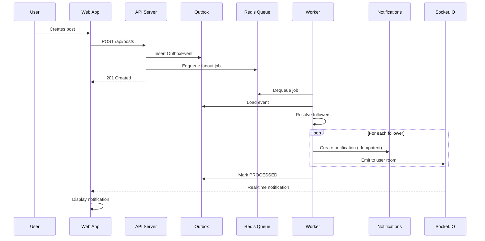

# Insyd Notifications System Design

## Overview

This document outlines the design of Insyd's notification system POC, optimized for ~100 DAUs with a clear scaling path to 1M+ users.

## 1. System Components

### Core Services

```
┌─────────────────┐    ┌─────────────────┐    ┌─────────────────┐
│   React Web     │    │   Express API   │    │ Background      │
│   + Socket.IO   │◄──►│   + Socket.IO   │◄──►│ Worker (BullMQ) │
│                 │    │                 │    │                 │
└─────────────────┘    └─────────────────┘    └─────────────────┘
                              │                        │
                              ▼                        ▼
                       ┌─────────────────┐    ┌─────────────────┐
                       │    MongoDB      │    │     Redis       │
                       │   (Documents)   │    │    (Queue)      │
                       └─────────────────┘    └─────────────────┘
```

### Component Responsibilities

**React Web App**
- User interface for demo/testing
- Real-time notification display via Socket.IO
- Action triggers (follow, post, like, comment)

**Express API Server**
- Event ingestion endpoint
- Notification CRUD operations
- Real-time Socket.IO emission
- Domain entity management

**Background Worker**
- Event processing and fan-out
- Notification creation with deduplication
- Socket.IO emission to user rooms
- Queue job processing

**MongoDB**
- Document storage for all entities
- Outbox pattern for reliability
- Notification persistence with indexing

**Redis**
- BullMQ job queue storage
- Worker job distribution
- Optional future caching layer

## 2. Execution Flow

### High-Level Sequence

```
User Action → Domain Event → Outbox → Worker Fan-out → Notifications → Socket.IO → Client Update
```

### Detailed Event Processing Flow



### Event Types & Fan-out Logic

**POST_CREATED**
- Recipients: All followers of post author
- Notification: `NEW_POST_FROM_FOLLOWING`

**FOLLOWED**
- Recipients: The user being followed
- Notification: `NEW_FOLLOWER`

**LIKED**
- Recipients: Post author (if not self-like)
- Notification: `NEW_LIKE_ON_YOUR_POST`

**COMMENTED**
- Recipients: Post author (if not self-comment)
- Notification: `NEW_COMMENT_ON_YOUR_POST`

## 3. Data Model

### Core Collections

```typescript
// Users - Basic identity
User {
  _id: ObjectId
  name: string
  createdAt: Date
}

// Social graph
Follow {
  _id: ObjectId
  followerId: ObjectId  // User._id
  followeeId: ObjectId  // User._id
  createdAt: Date
  
  // Unique index: (followerId, followeeId)
}

// Content entities
Post {
  _id: ObjectId
  authorId: ObjectId    // User._id
  content: string
  createdAt: Date
}

// Reliability pattern
OutboxEvent {
  _id: ObjectId
  type: "POST_CREATED" | "FOLLOWED" | "LIKED" | "COMMENTED"
  payload: object       // Event-specific data
  status: "PENDING" | "PROCESSED"
  dedupeKey: string     // Idempotency key
  createdAt: Date
  processedAt?: Date
  
  // Unique index: dedupeKey
}

// Notification storage
Notification {
  _id: ObjectId
  userId: ObjectId              // Recipient
  type: "NEW_FOLLOWER" | "NEW_POST_FROM_FOLLOWING" | 
        "NEW_LIKE_ON_YOUR_POST" | "NEW_COMMENT_ON_YOUR_POST"
  actorId: ObjectId            // Who triggered this
  entityId: ObjectId           // Related post/user ID
  entityType: "POST" | "USER"
  message: string              // Display text
  isRead: boolean = false
  dedupeKey: string           // Prevents duplicates
  deliveryStatus: "PENDING" | "EMITTED" | "FAILED"
  createdAt: Date
  
  // Unique index: dedupeKey
  // Compound index: (userId, createdAt desc)
}
```

### Indexing Strategy

**Critical Indexes:**
- `Follow`: `(followerId, followeeId)` - Prevent duplicate follows
- `OutboxEvent`: `dedupeKey` - Idempotency
- `Notification`: `dedupeKey` - Idempotency  
- `Notification`: `(userId, createdAt desc)` - Feed queries
- `Notification`: `userId, isRead` - Unread counts

## 4. API Design

### Event Ingestion
```
POST /api/events
Content-Type: application/json

{
  "type": "POST_CREATED",
  "actorId": "507f1f77bcf86cd799439011",
  "entityId": "507f1f77bcf86cd799439012", 
  "metadata": {
    "content": "New architecture project completed!"
  }
}

Response: 202 Accepted
```

### Notification Retrieval
```
GET /api/notifications?userId=<id>&limit=20&cursor=<timestamp>

Response: {
  "notifications": [...],
  "nextCursor": "2024-01-15T10:30:00Z",
  "hasMore": true
}
```

### Domain Operations
```
POST /api/follow      # Create follow relationship
POST /api/posts       # Create new post
GET /api/users        # List demo users
PATCH /api/notifications/:id/read  # Mark as read
```

## 5. Real-time Architecture

### Socket.IO Implementation

**Namespace**: `/notifications`
**Rooms**: `user:<userId>` (one room per user)

**Client Connection:**
```javascript
const socket = io('/notifications')
socket.emit('join', { userId: '507f...' })
```

**Server Emission:**
```javascript
io.of('/notifications')
  .to(`user:${userId}`)
  .emit('notification:new', { notification })
```

### Delivery Guarantees

- **At-least-once delivery** via outbox pattern
- **Idempotent processing** via dedupeKey
- **Failed delivery handling** with retry logic
- **Connection recovery** with notification backfill

## 6. Worker Architecture

### BullMQ Implementation

**Queue**: `outbox:fanout`
**Concurrency**: 5 jobs concurrent (configurable)
**Retry Strategy**: Exponential backoff, max 3 retries

```typescript
// Job payload
{
  outboxEventId: ObjectId,
  attempt: number
}

// Worker process
async function processEvent(job) {
  const event = await OutboxEvent.findById(job.data.outboxEventId)
  const recipients = await resolveRecipients(event)
  
  for (const userId of recipients) {
    await createNotification(event, userId)
    await emitToUser(userId, notification)
  }
  
  await OutboxEvent.updateOne(
    { _id: event._id },
    { status: 'PROCESSED', processedAt: new Date() }
  )
}
```

## 7. Idempotency & Deduplication

### Strategies

**Event Level**: `dedupeKey = ${type}:${actorId}:${entityId}:${timestamp}`
**Notification Level**: `dedupeKey = ${eventId}:${userId}`

### Implementation
```typescript
// Idempotent event ingestion
try {
  await OutboxEvent.create({ ...event, dedupeKey })
} catch (error) {
  if (error.code === 11000) { // Duplicate key
    return { status: 'already_processed' }
  }
  throw error
}
```

## 8. Current Scale Characteristics (100 DAU)

### Performance Targets
- **Event ingestion**: 100 events/sec
- **Notification creation**: 1,000 notifications/sec  
- **Real-time delivery**: <100ms p95
- **Feed loading**: <200ms p95

### Resource Requirements
- **API**: 1 instance, 512MB RAM
- **Worker**: 1 instance, 256MB RAM
- **MongoDB**: Shared cluster, <1GB data
- **Redis**: 128MB instance

## 9. Scaling Path to 1M DAU

### Bottlenecks & Solutions

**Current Limitations:**
- Single worker instance
- Socket.IO sticky sessions required
- MongoDB collection scans for large fan-outs
- In-memory Redis queue

**Scale Solutions:**

#### Phase 1: Horizontal Scaling (10K DAU)
- Multiple worker instances
- Load balancer with sticky sessions
- MongoDB replica set
- Redis cluster

#### Phase 2: Architecture Changes (100K DAU)
- Replace BullMQ with Apache Kafka/Google PubSub
- Implement notification sharding by userId
- Add read replicas for feed queries
- Notification batching and collapsing

#### Phase 3: Advanced Optimizations (1M+ DAU)
```
                    ┌─────────────────┐
                    │   Event Ingestion│
                    │    (Load Balanced)│
                    └─────────────────┘
                              │
                              ▼
                    ┌─────────────────┐
                    │  Apache Kafka   │
                    │  (Partitioned)  │
                    └─────────────────┘
                              │
                   ┌──────────┴──────────┐
                   ▼                     ▼
        ┌─────────────────┐    ┌─────────────────┐
        │ Worker Cluster  │    │ Worker Cluster  │
        │   (Shard A)     │    │   (Shard B)     │
        └─────────────────┘    └─────────────────┘
                   │                     │
                   ▼                     ▼
        ┌─────────────────┐    ┌─────────────────┐
        │  DynamoDB/      │    │  DynamoDB/      │
        │  ScyllaDB       │    │  ScyllaDB       │
        │  (User 0-50%)   │    │  (User 50-100%) │
        └─────────────────┘    └─────────────────┘
```

#### Advanced Features
- **Write-optimized storage**: DynamoDB or ScyllaDB
- **Notification digesting**: Batch similar notifications
- **Multi-region deployment**: Geographic distribution
- **WebPush integration**: Replace Socket.IO
- **ML-powered relevance**: Smart notification filtering

## 10. Performance Considerations

### Current Optimizations
- MongoDB compound indexes for feed queries
- Cursor-based pagination (no OFFSET)
- Selective field projection
- Connection pooling
- Idempotent processing

### Monitoring Metrics
- Event ingestion rate and latency
- Worker processing throughput
- Notification delivery success rate
- Socket.IO connection count
- Database query performance

## 11. Reliability Patterns

### Outbox Pattern
Ensures events are never lost even if worker is down:
1. Write event to outbox in same transaction
2. Worker polls outbox for unprocessed events
3. Mark processed only after successful fan-out

### Error Handling
- **Transient failures**: Exponential backoff retry
- **Permanent failures**: Dead letter queue
- **Partial failures**: Per-recipient error tracking
- **Circuit breakers**: Prevent cascade failures

## 12. Current Limitations

### Technical Debt
- No authentication/authorization
- Single Redis instance (SPOF)
- No rate limiting or backpressure
- Limited observability
- No data retention policies

### Operational Gaps  
- No health checks or metrics
- No deployment automation
- No backup/recovery procedures
- No performance testing
- No security hardening

## 13. Future Backlog

### Core Features
- [ ] User authentication & sessions
- [ ] Email notification delivery
- [ ] Push notification (WebPush/FCM)
- [ ] Notification preferences center
- [ ] Digest/summary notifications
- [ ] Notification templates

### Platform Features
- [ ] Multi-tenancy support
- [ ] GDPR compliance (data export/deletion)
- [ ] Advanced analytics dashboard  
- [ ] A/B testing framework
- [ ] Webhook delivery to third parties

### Reliability & Scale
- [ ] Database sharding strategy
- [ ] Multi-region deployment
- [ ] Advanced monitoring (OpenTelemetry)
- [ ] Chaos engineering tests
- [ ] Performance benchmarking suite
- [ ] Automated failover procedures

### Developer Experience
- [ ] GraphQL API alternative
- [ ] SDK for easy integration
- [ ] Notification simulator/debugger
- [ ] Load testing tools
- [ ] Documentation site

---

This design balances simplicity for the current scale while maintaining clear upgrade paths for future growth. The outbox pattern and idempotency ensure reliability, while the modular architecture enables independent scaling of components.